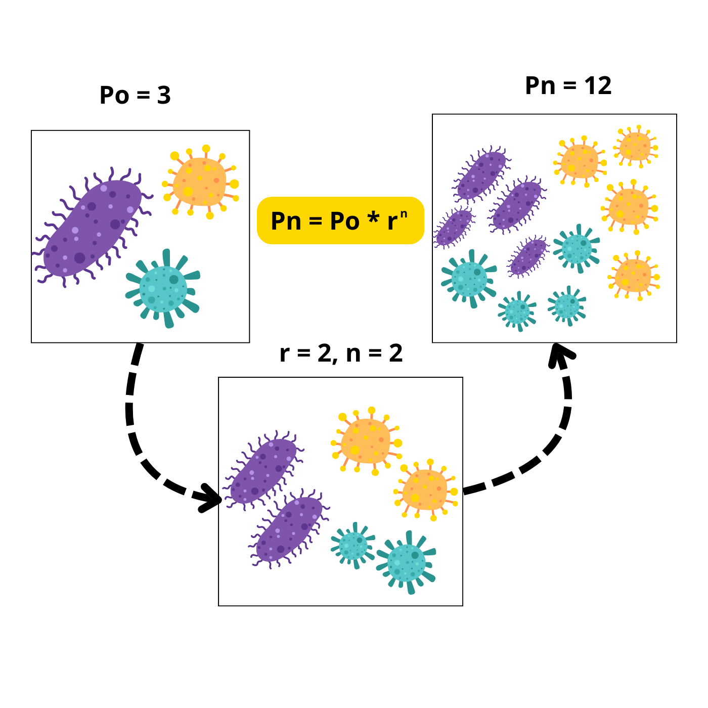
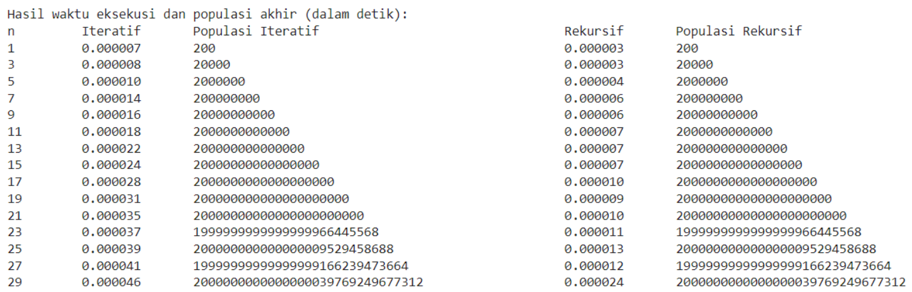
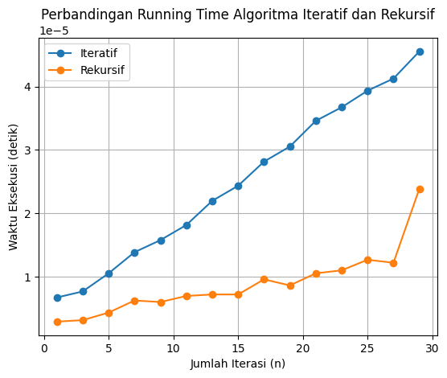
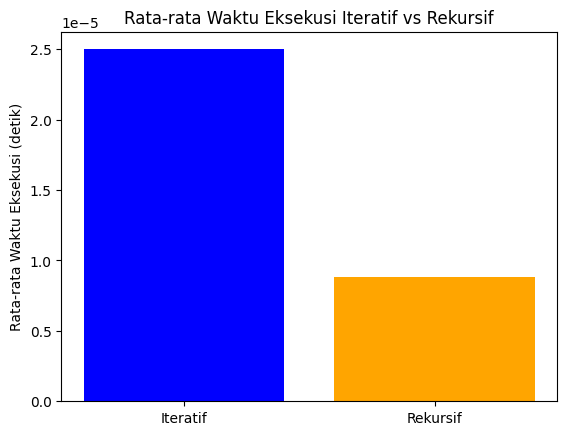
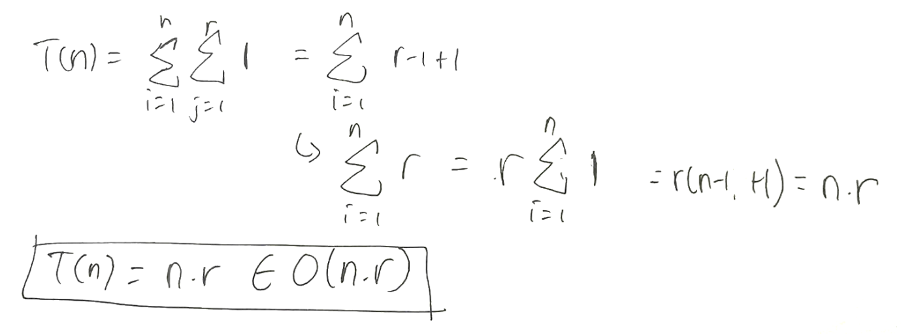
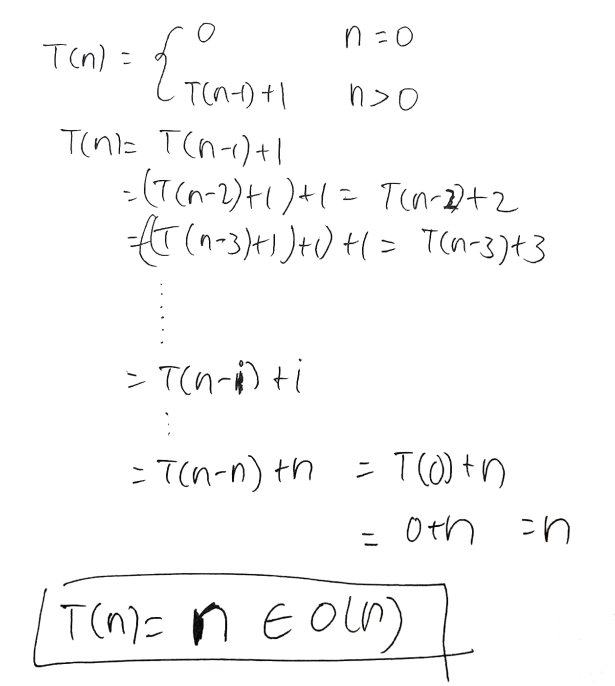
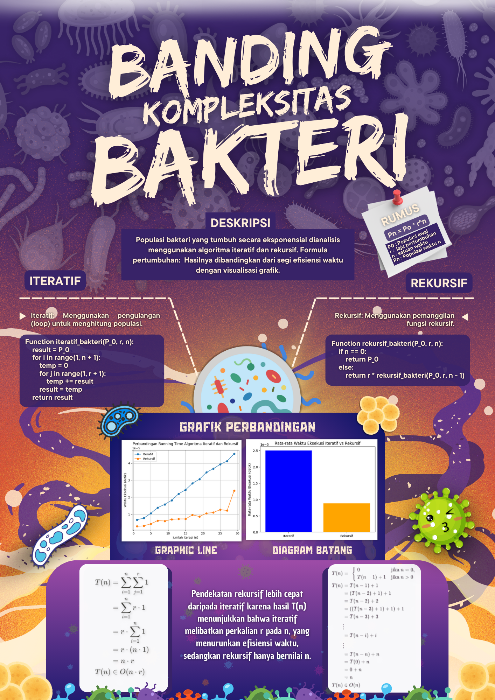
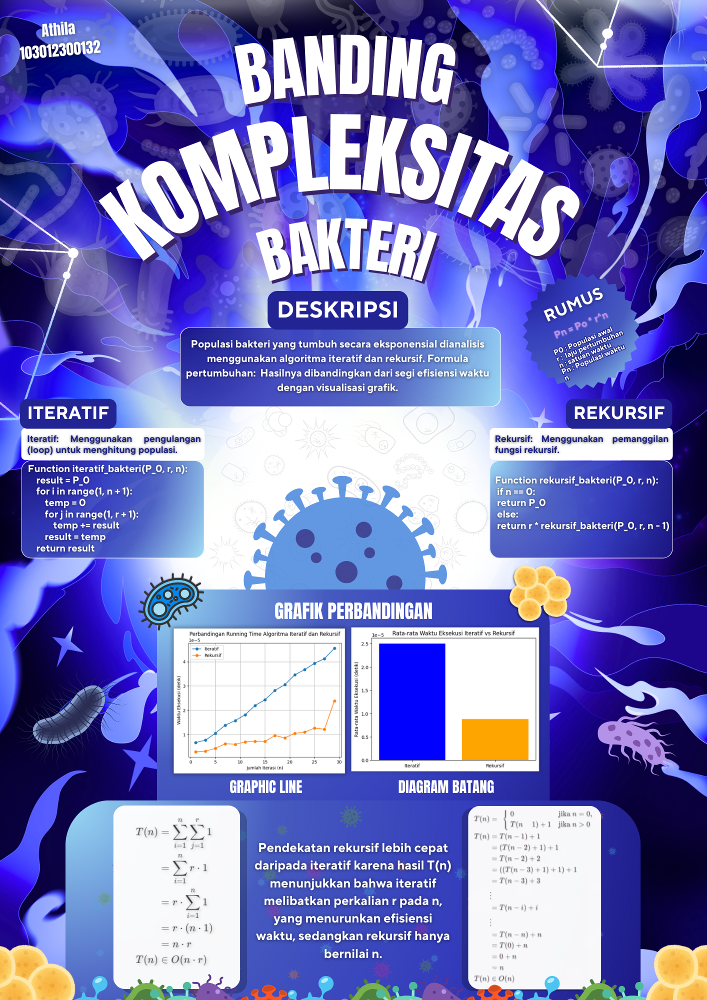

# Laporan Tugas Besar - Analisis Kompleksitas Algoritma

## Topik: Perkembangan Populasi Bakteri Menggunakan Perpangkatan Eksponensial

### Disusun oleh:
- **Athila Ramdani Saputra** (103012300132)  
- **Bill Stephen** (103012330197)

---

### Program Studi S1 Informatika  
Fakultas Informatika  
Universitas Telkom  
Bandung, 2024-2025

---

## 1. Deskripsi Studi Kasus Permasalahan

Dalam studi ini, kami menganalisis perkembangan populasi bakteri yang tumbuh secara eksponensial. Misalnya, sebuah populasi bakteri memiliki ukuran awal \( P_0 \) dan berkembang dengan laju pertumbuhan \( r \) setiap satuan waktu \( n \). Maka populasi pada waktu \( n \) (\( P_n \)) dapat dihitung menggunakan formula:

\[ P_n = P_0 . r^n \]



Kami mengimplementasikan algoritma iteratif dan rekursif untuk menghitung populasi ini, menganalisis kompleksitas waktu, dan menampilkan grafik perbandingan waktu eksekusi.

---

## 2. Deskripsi Algoritma Iteratif dan Rekursif

### a. Algoritma Iteratif
Pada pendekatan iteratif, populasi dihitung menggunakan pengulangan (loop). 

#### Pseudocode:
```
Function Iteratif_bakteri(P_0, r, n):
    result <- P_0
    for i <- 1 to n do:
        temp <- 0
        for j <- 1 to r do:
            temp <- temp + result
        result <- temp
    return result
```

#### Python Implementation:
```python
def iteratif_bakteri(P_0, r, n):
    result = P_0
    for i in range(1, n + 1):
        temp = 0
        for j in range(1, r + 1):
            temp += result
        result = temp
    return result
```

### b. Algoritma Rekursif
Pada pendekatan rekursif, populasi dihitung menggunakan:
\[ P_n = r \times P_{n-1} \]

#### Pseudocode:
```
Function Rekursif_bakteri(P_0, r, n):
    if n == 0:
        return P_0
    else:
        return r * Rekursif_bakteri(P_0, r, n - 1)
```

#### Python Implementation:
```python
def rekursif_bakteri(P_0, r, n):
    if n == 0:
        return P_0
    else:
        return r * rekursif_bakteri(P_0, r, n - 1)
```

---

## 3. Grafik Perbandingan Running Time

Studi ini membandingkan waktu eksekusi algoritma iteratif dan rekursif untuk \( n \) dari 1 hingga 30 dengan \( P_0 = 20 \) dan \( r = 10 \).

#### Python Code:
```python
import time
import matplotlib.pyplot as plt

# Parameter studi kasus
P0 = 20  # Populasi awal
r = 10   # Laju pertumbuhan
n_values = [i for i in range(1, 30, 2)]

# Waktu eksekusi
iterative_times = []
recursive_times = []

for n in n_values:
    # Iteratif
    start_time = time.time()
    iteratif_population = iteratif_bakteri(P0, r, n)
    iterative_times.append(time.time() - start_time)

    # Rekursif
    start_time = time.time()
    rekursif_population = rekursif_bakteri(P0, r, n)
    recursive_times.append(time.time() - start_time)

# Plot grafik waktu eksekusi
plt.plot(n_values, iterative_times, label='Iteratif', marker='o')
plt.plot(n_values, recursive_times, label='Rekursif', marker='o')
plt.xlabel('Jumlah Iterasi (n)')
plt.ylabel('Waktu Eksekusi (detik)')
plt.title('Perbandingan Running Time Algoritma Iteratif dan Rekursif')
plt.legend()
plt.grid()
plt.show()
```



### Visualisasi Hasil:
- Grafik perbandingan running time iteratif dan rekursif.



- Diagram batang rata-rata waktu eksekusi iteratif vs rekursif.



---

## 4. Analisis Algoritma

### Kompleksitas Waktu:
- **Iteratif:** \( O(n \times r) \)



- **Rekursif:** \( O(n) \)



### Hasil Perbandingan:
Pendekatan rekursif lebih efisien dibandingkan iteratif. Hal ini disebabkan algoritma iteratif memiliki kompleksitas \( O(n . r) \), sementara rekursif hanya \( O(n) \).





---

## 5. Referensi

1. Thomas H. Cormen, Charles E. Leiserson, Ronald L. Rivest, Clifford Stein. *Introduction to Algorithms (3rd Edition)*.
2. Python Software Foundation. *Python 3.11 Documentation*.
3. Google Colab: [Link Project](https://colab.research.google.com/drive/1rr7R_Ll0m70GhUJxlQ2TpB9-7iE0P80c?usp=sharing)
4. Canva: [Desain Ilustrasi](https://www.canva.com/design/DAGZeqZeKXE/-SrmrqAvZjQWtKnk60pGtA/view)
5. Canva: [Poster Studi Kasus](https://www.canva.com/design/DAGaFtGemaM/cE5JYBYz8QBAb46273PGLg/view)
